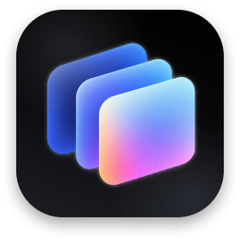
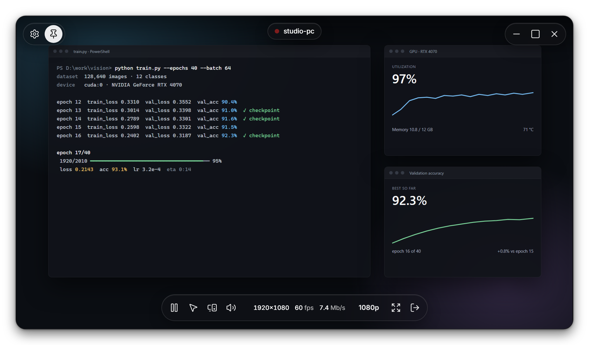
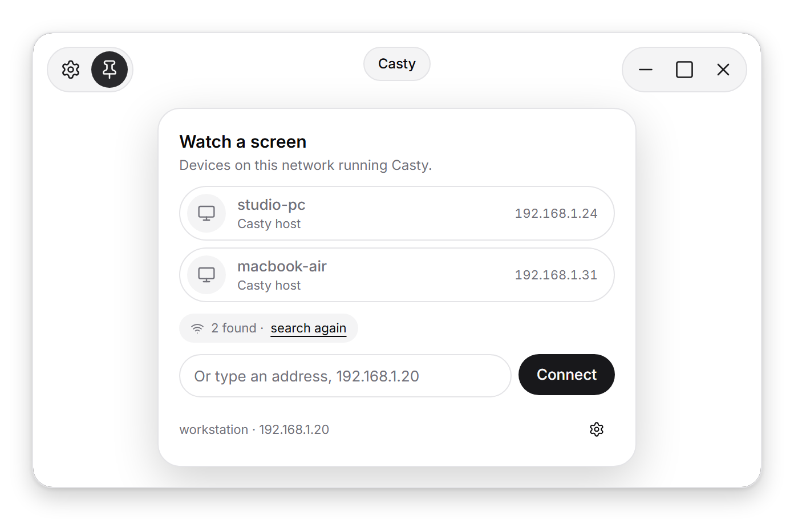
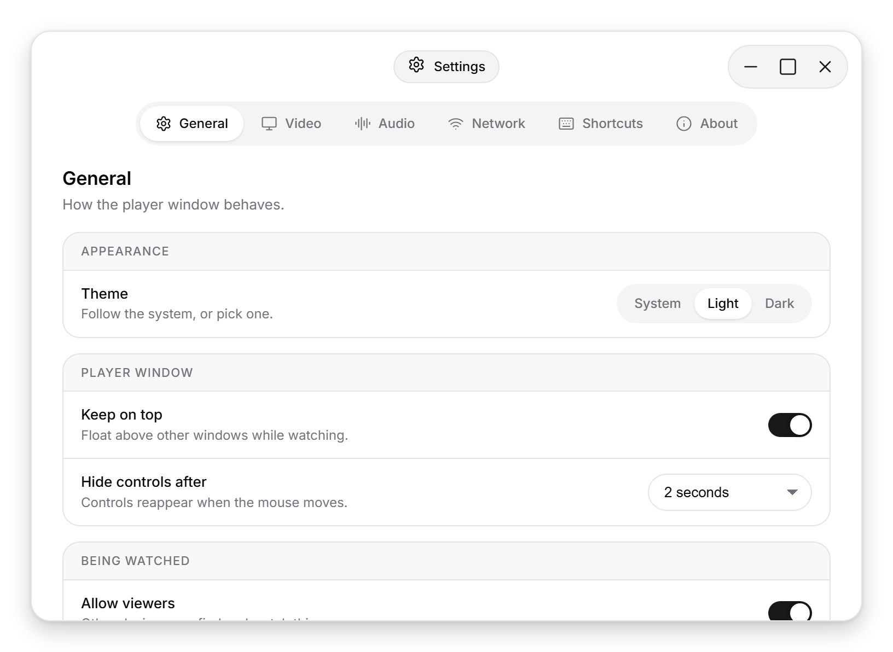

<p align="center">
  
</p>

<h1 align="center">Casty</h1>

<p align="center">
  Watch, hear and control your Windows PC or Mac from another computer on the same network.<br>
  A floating player with system sound and remote control. No cloud, no account, no relay.
</p>

<p align="center">
  <a href="https://github.com/NourEldinShobier/casty/releases/latest"></a>
  <a href="https://github.com/NourEldinShobier/casty/actions/workflows/build.yml"></a>
  
</p>

<p align="center">
  
</p>

Casty started as a way to keep an eye on a long build or training run without walking back to the desk. Run it on the machine you want to watch and on the one in front of you. The second finds the first on its own and shows its screen in a small window that stays on top of everything else. The picture and sound go straight from one machine to the other over your local network.

<table>
  <tr>
    <td align="center" width="50%">
      <picture>
        <source media="(prefers-color-scheme: dark)" srcset="docs/picker-dark.png">
        
      </picture>
      <br><sub>Computers running Casty appear on their own</sub>
    </td>
    <td align="center" width="50%">
      <picture>
        <source media="(prefers-color-scheme: dark)" srcset="docs/settings-dark.png">
        
      </picture>
      <br><sub>Settings, in light and dark</sub>
    </td>
  </tr>
</table>

## Features

- **Finds devices on its own.** A broadcast goes out on every network the machine is on. When a VPN swallows it, Casty scans the local subnet instead. You can always type an address.
- **Floating player.** Frameless and rounded, stays on top, resizes from any edge, and expands to fill the screen. The controls fade while you watch and come back when the mouse moves.
- **Quality you pick per viewer.** Four presets from 640p at 30 fps to native resolution at 60 fps, plus a display picker. The watched machine encodes each viewer at the size it asked for.
- **Sound where you want it.** Play the watched machine's sound there, on your side, or both. Casty's volume slider changes only Casty.
- **Remote control.** Drive the other machine's mouse and keyboard. It is off until you switch it on at the machine being watched, and Ctrl+Alt+Shift+C always hands the keyboard back.
- **Know who is watching.** The watched machine shows a small card with each viewer, where the sound plays, and a Stop button.
- **Light and dark.** Follows the system, or pick one in Settings.
- **VPN friendly.** Works alongside VPNs that allow local network sharing, such as Mullvad.

## Download

Get the latest build from the [releases page](https://github.com/NourEldinShobier/casty/releases/latest).

| Platform | File |
| --- | --- |
| Windows 10 and 11, x64 | `Casty_<version>_x64-setup.exe`, or the `.msi` |
| macOS 13 or later, Apple Silicon and Intel | `Casty_<version>_universal.dmg` |

Both computers need Casty and the same local network. Casty uses TCP port 45455 for the stream and UDP port 45454 to find devices.

### First run

**Windows.** The installer is not signed yet, so SmartScreen may warn you: choose More info, then Run anyway. The `setup.exe` also adds firewall rules for private networks. With the `.msi`, allow Casty when Windows asks.

**macOS.** The app is not notarized yet. Drag Casty to Applications, then right-click it and choose Open, or allow it under System Settings, Privacy & Security. If macOS reports the app as damaged, run:

```bash
xattr -dr com.apple.quarantine /Applications/Casty.app
```

To be watched, a Mac needs Screen Recording access. To be controlled, it also needs Accessibility access. Casty asks for both and links to the right pane.

**On a VPN.** Turn on local network sharing on both computers. Each device has its own switch.

## How it works

Casty is a [Tauri 2](https://tauri.app) app with a Rust core and a plain HTML and JavaScript interface.

1. The screen is captured with Windows Graphics Capture or ScreenCaptureKit.
2. Frames are scaled and converted to YUV with SIMD, then encoded to H.264 with OpenH264, multi-threaded.
3. The stream is a single chunked HTTP response of length-prefixed packets. Control messages, including mouse and keyboard input, go back as small POST requests.
4. The viewer decodes with WebCodecs on the hardware decoder and plays sound through Web Audio. System sound comes from WASAPI loopback or ScreenCaptureKit.

HTTP streaming is used instead of WebSocket because WebView2 refuses `ws://` from the app's own origin, and plain HTTP works in every webview without a plugin. If the network falls behind, frames are dropped and the encoder is asked for a fresh keyframe, so the picture catches up instead of lagging.

Input is sent as one command per line: `m x y` with coordinates from 0 to 1 across the display, `d` and `u` for buttons, `s` for scroll, `kd` and `ku` with the key's physical `KeyboardEvent.code`. Physical codes mean a different keyboard layout on the viewer still presses the right key, and normalised coordinates mean the viewer never needs the other screen's resolution or scaling.

## Build from source

You need Rust, Node 22, the Tauri CLI (`npm i -g @tauri-apps/cli@2`) and [NASM](https://www.nasm.us). NASM enables OpenH264's assembly path; without it, encoding is about three times slower.

```bash
# Windows
tauri build --bundles nsis,msi
```

```bash
# macOS, Apple Silicon and Intel in one app
brew install nasm
rustup target add aarch64-apple-darwin x86_64-apple-darwin
tauri build --target universal-apple-darwin --bundles app,dmg
```

On macOS 26, an app that ships only an `.icns` icon is drawn on a grey plate. The Liquid Glass icon in `src-tauri/icons/AppIcon.icon` has to be compiled into `Assets.car` with Xcode 26's `actool` first. The [build workflow](.github/workflows/build.yml) shows the exact command.

Set `CASTY_DEBUG=1` to print per-second stats on the watched machine: frame rate, conversion and encode time, and bitrate. After editing anything in `ui/`, touch `src-tauri/src/lib.rs` before `cargo build`, or the old files stay embedded. `npm run icons` regenerates `ui/icons.js` from Lucide.

Pushing a tag such as `v0.2.4` builds both platforms and publishes a release with the installers attached.

## Known limits

- Encoding runs on the CPU. Hardware encoding (NVENC, Media Foundation, VideoToolbox) is the next step.
- Windows only sends frames when the screen changes, so a still desktop streams at close to 0 fps. Sound likewise sends nothing while the machine is silent.
- Remote control drives the primary display only.
- Ctrl+Alt+Del cannot be sent, because Windows allows no ordinary program to produce it. Ctrl+Shift+Esc opens Task Manager instead.
- No clipboard sync yet.
